# NUMENEON

> A social media app with a unique **River Timeline** feed design.

Built with **React + Vite** (frontend) and **Django REST Framework** (backend).

---

## 🌊 The River Timeline

NUMENEON's signature feature is the **River Timeline** — a feed that flows like three parallel streams instead of one endless scroll.

```
┌─────────────────────────────────────────────────────────┐
│                    RIVER TIMELINE                        │
├───────────────┬───────────────┬─────────────────────────┤
│ 💭 THOUGHTS   │ 🖼️ MEDIA      │ 🏆 MILESTONES           │
│ Text posts    │ Photos/videos │ Achievements            │
├───────────────┼───────────────┼─────────────────────────┤
│ User A Ep2    │ User A Ep2    │ User A Ep2              │
│ [◀ 2/12 ▶]    │ [◀ 1/12 ▶]    │                         │
├───────────────┼───────────────┼─────────────────────────┤
│ User B        │ User B        │ User B                  │
│ [◀ 5/12 ▶]    │ [◀ 3/12 ▶]    │ [◀ 1/12 ▶]              │
├───────────────┼───────────────┼─────────────────────────┤
│ User A Ep1    │ User A Ep1    │ User A Ep1              │
│ [12/12 full]  │ [◀ 3/12 ▶]    │                         │
└───────────────┴───────────────┴─────────────────────────┘
```

**Digital Congestion vs. Traffic Management**

Modern social feeds suffer from "Information Congestion"—everything fights for the same narrow vertical space. The River Timeline treats UI as a traffic management system:

1.  **Horizontal Currents:** Instead of a congested single lane, the design creates parallel flows for **Thoughts**, **Media**, and **Milestones**.
2.  **The "Sluice Gate" (The Split):** By limiting each row to 12 items, the feed curates the flood. The code stops the scroll before it becomes overwhelming.
3.  **Congestion Control:** Grouping data enables a "3-lane highway" of visibility vs. a single-lane jam.

**How it works:**

- **One User, One Row:** Posts are grouped by category (Thoughts, Media, Milestones).
- **Smart Overflow:** If a category has more than 12 posts, it creates a separate row for the overflow.
- **Persistent Control:** A user can collapse any category they don't want to see. This preference saves to `localStorage`.
  - _Auto-Expand:_ If a new post arrives in a collapsed category, it automatically re-opens so you never miss new context.

**Architectural Logic: "The Chain"**

The frontend transforms raw data into the River flow in 4 explicit steps:

`PostsContext` (holds posts) → `Home.jsx` (passes posts) → `TimelineRiverFeed`:

1.  **GROUP** — `groupPostsByUser()` puts posts into buckets by user
2.  **SORT** — `sortGroupedPosts()` orders users by most recent activity
3.  **SPLIT** — `splitGroupIntoRows()` enforces the max-12 limit
4.  **RENDER** — `TimelineRiverRow` displays the organized rows

See [docs/features/RiverTimeline.md](./docs/features/RiverTimeline.md) for the full technical specification.

---

## ✨ Key Features

| Feature                  | Description                                                           |
| ------------------------ | --------------------------------------------------------------------- |
| **River Timeline**       | Three-column feed with epoch-based grouping and carousel navigation   |
| **Profile Flip Card**    | Dual-sided card — profile info on front, analytics dashboard on back  |
| **Engagement Analytics** | Wave chart + GitHub-style activity heatmap                            |
| **Direct Messaging**     | Real-time DMs with conversation list                                  |
| **User Navigation**      | Click any avatar/username to view their profile                       |
| **Card User Headers**    | Every card shows who posted it (avatar + username inside)             |
| **Mobile Category Tabs** | Tab-based navigation for mobile (Thoughts/Media/Milestones)           |
| **Search Modal**         | Search users and posts globally                                       |
| **Theme Toggle**         | Dark mode (cyberpunk) / Light mode (platinum brushed aluminum)        |
| **MyStudio**             | Nostalgic throwback profile with music player, Top 8 Friends, themes  |
| **Daily Learning**       | Study tool: Big O, loops, methods, tech jargon, vocabulary, mythology |
| **Bilingual Support**    | English/Spanish toggle for Daily Learning (embedded translations)     |
| **Post Composer**        | Create posts with category selection (Thoughts/Media/Milestones)      |
| **Media Lightbox**       | Full-screen image/video viewer for media posts                        |
| **Post Detail Modal**    | Expanded view of any post with full interactions                      |

### 🔌 Stretch Feature: WebSockets

As a stretch goal, the team implemented **real-time notifications** using Django Channels + WebSockets:

- **Friend request accepted** — Toast notification appears instantly
- **New friend request** — Badge updates in real-time
- **Live messaging** — Messages arrive without polling

See [docs/features/WebSocketsStretchGoal.md](./docs/features/WebSocketsStretchGoal.md) for implementation details.

### 🎵 MyStudio (Throwback Feature)

A nostalgic tribute to early social media profiles:

- **Music Player** — Custom stereo with CodePen-style volume knob, playlist management
- **Top 8 Friends** — Classic friend grid with ranked slots
- **Theme Picker** — Customize your profile colors and aesthetic
- **Profile Section** — Personal info, current mood, and song

### 📚 Daily Learning

Built-in study tool for developers at `/learn`:

| Category    | Content                                     |
| ----------- | ------------------------------------------- |
| Tech Jargon | Industry terminology and concepts           |
| Big O       | Algorithm complexity analysis               |
| Loops       | Loop patterns and use cases                 |
| Methods     | JavaScript/Python method reference          |
| Vocabulary  | SAT/GRE vocabulary (948 words)              |
| Mythology   | Greek/Roman mythology (memory palace theme) |

**Features:**

- **Bilingual Support** — Toggle between English and Spanish (preference saved to localStorage)
- **Mark as Known** — Track learning progress across sessions
- **Daily Rotation** — New content each day based on date
- **Deep Linking** — Navigate directly to categories via URL params (e.g., `/learn?tab=bigO`)

### 🌐 Translation Architecture

Daily Learning supports **embedded Spanish translations** — no external API calls required:

```javascript
// Each JSON item has inline translations
{
  "term": "Big O Notation",
  "definition": "Mathematical notation...",
  "definition_es": "Notación matemática...",   // ← embedded
  "example": "O(n) - linear time",
  "example_es": "O(n) - tiempo lineal"         // ← embedded
}
```

**Translation Fields by Category:**
| Category | Translated Fields |
| ----------- | ---------------------------------------------- |
| Tech Jargon | `term_es`, `definition_es`, `example_es`, `sentence_es` |
| Big O | `term_es`, `definition_es`, `example_es`, `realWorld_es` |
| Loops | `definition_es`, `bestFor_es`, `gotcha_es` |
| Methods | `definition_es`, `gotcha_es` |
| Mythology | `culture_es`, `definition_es`, `myth_es`, `symbol_es` |

The helper function `getTranslatedItem()` reads these `_es` fields when Spanish is selected.

---

## 🚀 Quick Start

### Prerequisites

- Python 3.10+
- Node.js 18+

### Backend

```bash
cd backend
python -m venv venv
source venv/bin/activate  # Windows: venv\Scripts\activate
pip install -r requirements.txt
python manage.py migrate
python seed_posts.py       # Create demo data
python manage.py runserver
```

### Frontend

```bash
cd frontend
npm install
npm run dev
```

App runs at `http://localhost:5173` • API at `http://localhost:8000`

---

## 📁 Project Structure

```
numeneon/
├── backend/                 # Django REST API
│   ├── numeneon/           # Project settings
│   ├── users/              # Auth & profiles
│   ├── posts/              # Posts, likes, replies
│   ├── friends/            # Friend requests & connections
│   └── seed_posts.py       # Demo data generator
│
├── frontend/               # React + Vite
│   └── src/
│       ├── components/
│       │   ├── layout/     # TopBar, SideNav
│       │   ├── pages/      # Home, Profile, MyStudio, Learn, Friends, etc.
│       │   └── ui/         # AuthLoader, ThemeToggle, Modals
│       ├── contexts/       # Auth, Posts, Friends, Messages, Theme, WebSocket, Notification, Search
│       ├── data/           # Daily learning content (JSON with embedded translations)
│       ├── hooks/          # Custom React hooks
│       ├── services/       # API client
│       └── styles/         # Global SCSS design system
│
└── docs/                   # Documentation
    ├── features/           # Feature specs (RiverTimeline, etc.)
    └── features-implemented/  # Implementation details
```

---

## 🎨 Design System

**Colors:**

- Cyan `#4fffff` — Thoughts, primary actions
- Purple `#c9a8ff` — Media, secondary
- Green `#1ae784` — Milestones, success
- Magenta `#e94ec8` — Accents

**Fonts:**

- Orbitron — Headings (futuristic)
- Rajdhani — Body text (clean, readable)

**Effects:**

- Glassmorphic surfaces with backdrop blur
- Neon glow shadows
- Chamfered corners (clip-path, not border-radius)
- Scan line overlays

---

## 📖 Documentation

- [Backend Setup](./BACKEND_SETUP.md)
- [River Timeline](./docs/features/RiverTimeline.md)
- [Implemented Features](./docs/features-implemented/README.md)
- [Visual Identity](./docs/features/VisualIdentitySystem.md)

---

## 📸 Screenshots

### Core Pages

| Landing                                                        | Sign In                                                   | Sign Up                                                   |
| -------------------------------------------------------------- | --------------------------------------------------------- | --------------------------------------------------------- |
| 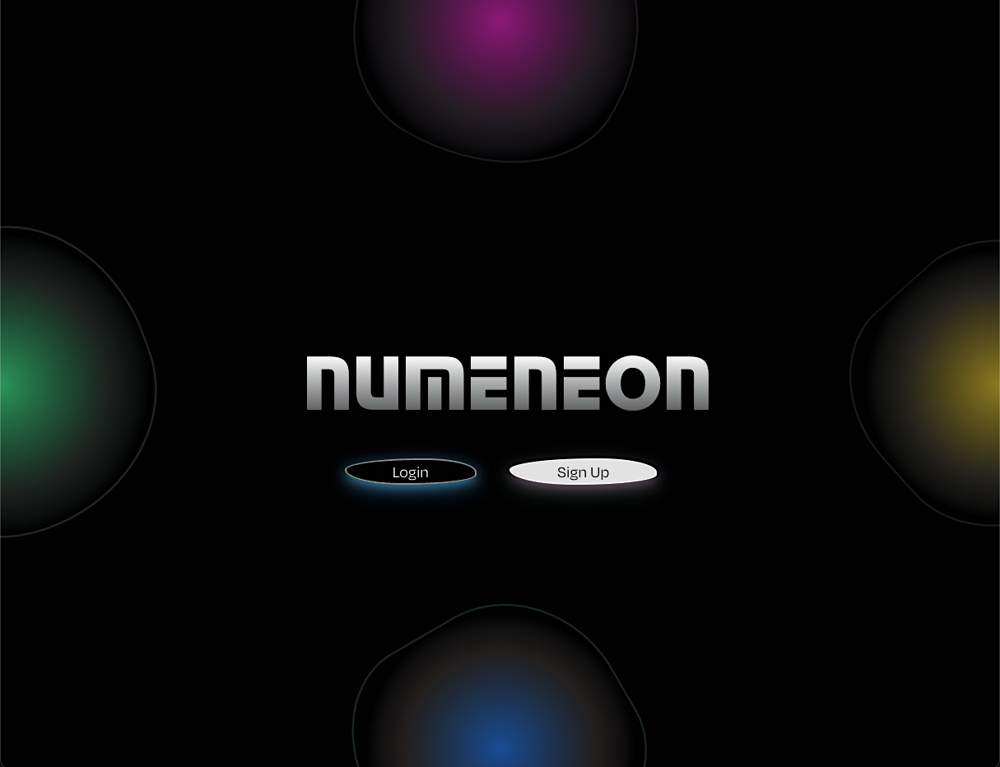 | 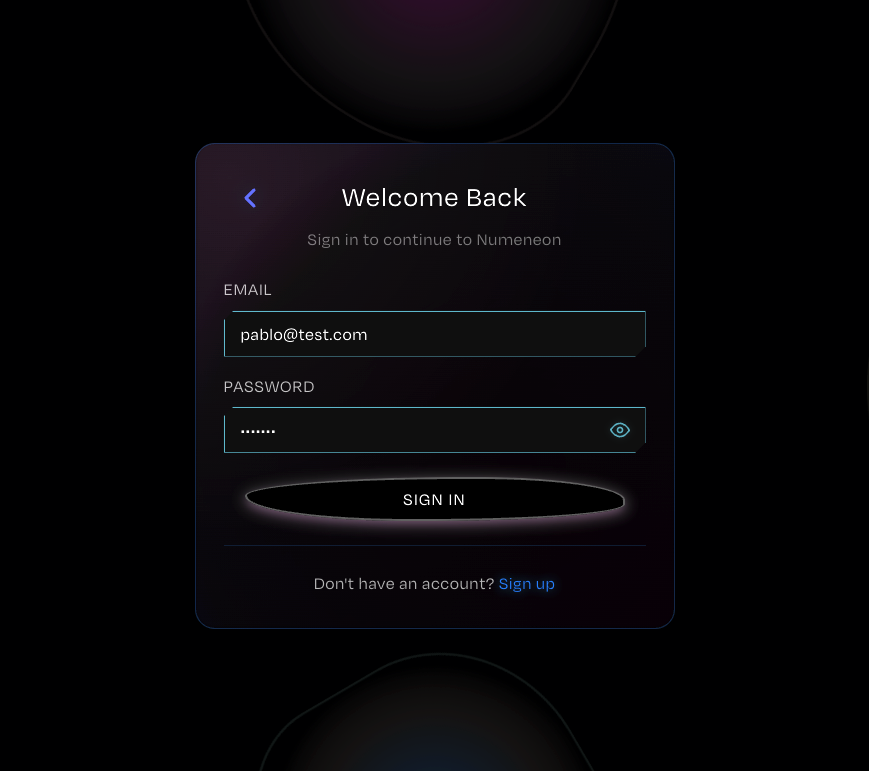 | 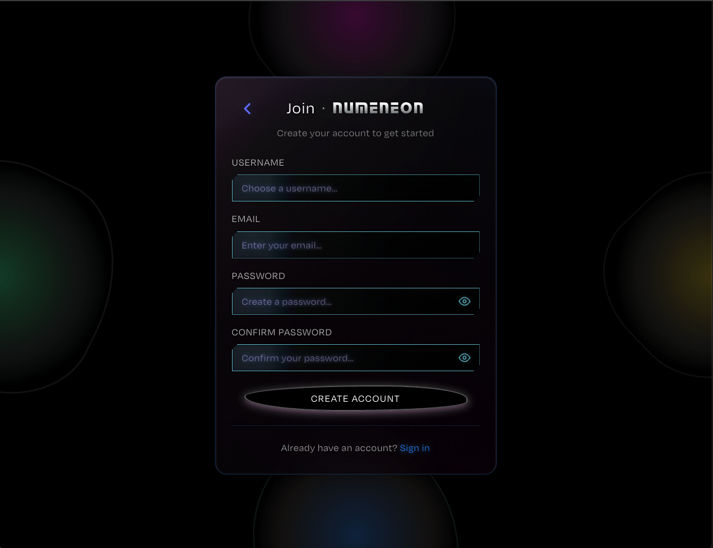 |

| Feed (Dark)                                              | Profile (Dark)                                                      | Friends                                                             |
| -------------------------------------------------------- | ------------------------------------------------------------------- | ------------------------------------------------------------------- |
|  | 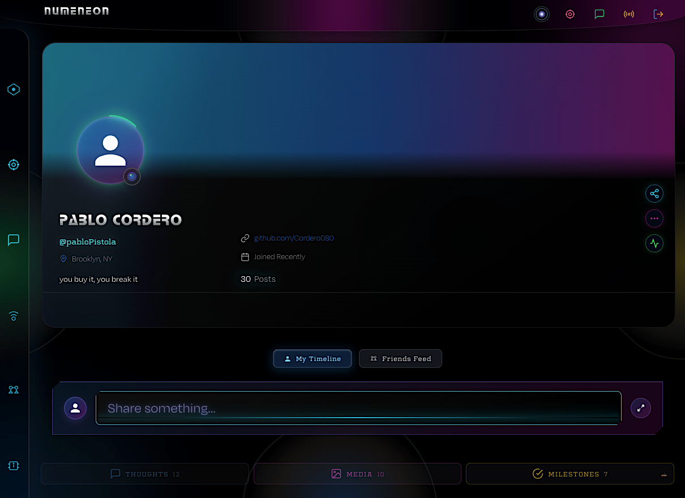 |  |

### Activity Visualizations

| Wave Chart                                                      | Heat Map                                                   |
| --------------------------------------------------------------- | ---------------------------------------------------------- |
| 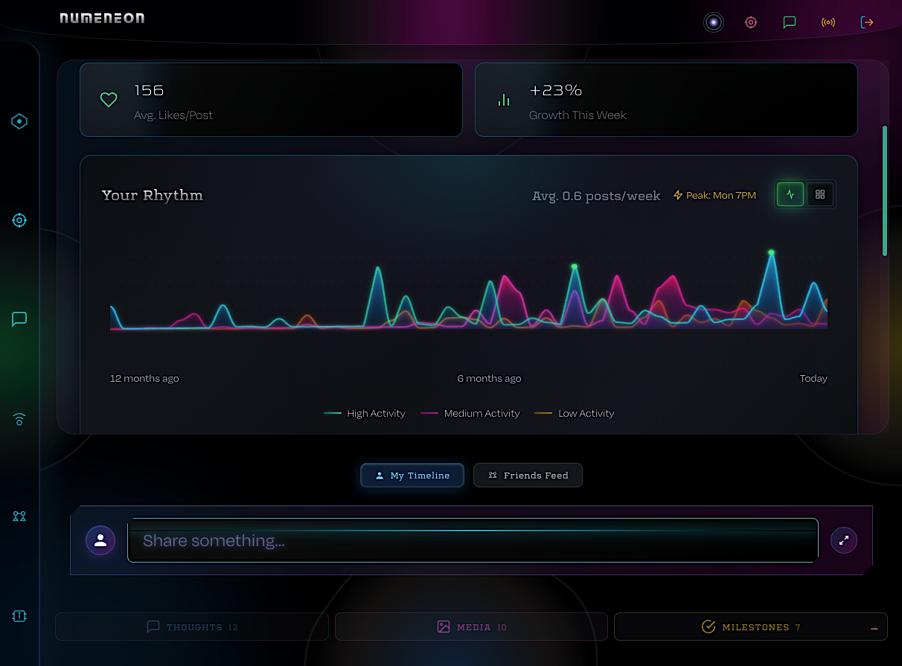 | 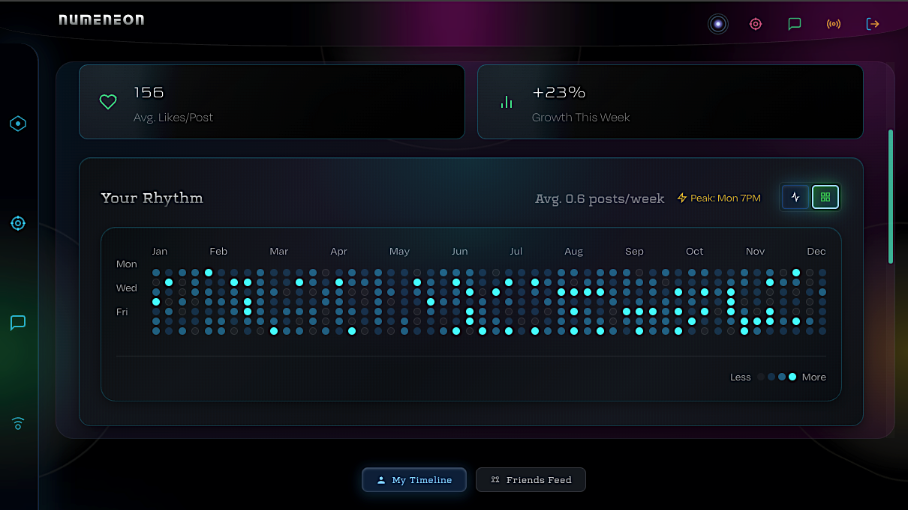 |

### Mobile Responsive

| Feed                                                              | Profile                                                                 | Friends                                                                 |
| ----------------------------------------------------------------- | ----------------------------------------------------------------------- | ----------------------------------------------------------------------- |
| 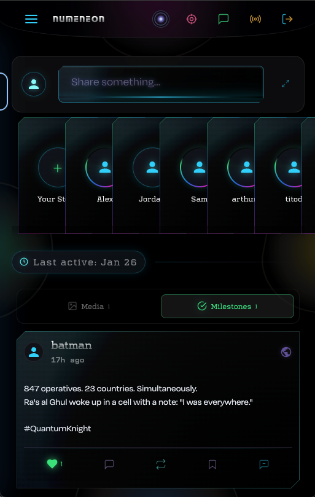 | 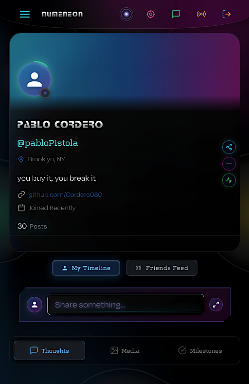 | 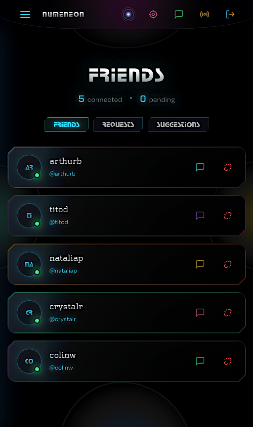 |

| Messages                                                                  | Side Nav                                                                  |
| ------------------------------------------------------------------------- | ------------------------------------------------------------------------- |
|  | 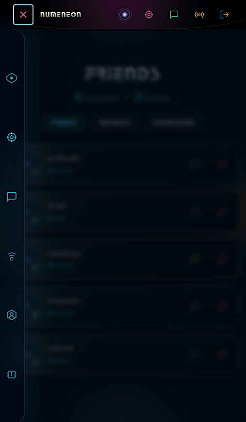 |

### Light Mode

| Feed                                                                     | Profile                                                                        |
| ------------------------------------------------------------------------ | ------------------------------------------------------------------------------ |
| 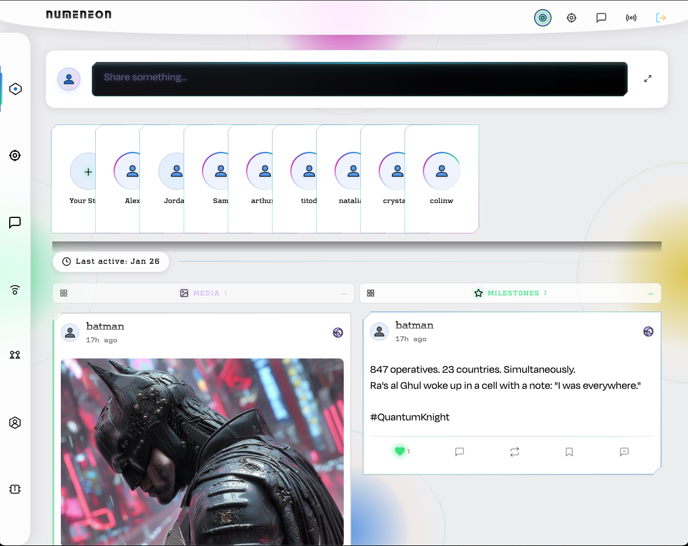 | 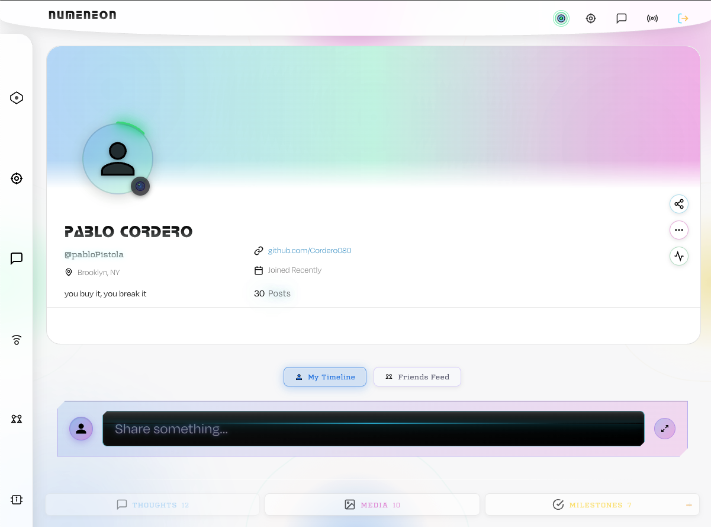 |

| Wave Chart                                                                           | Heat Map                                                                        |
| ------------------------------------------------------------------------------------ | ------------------------------------------------------------------------------- |
| 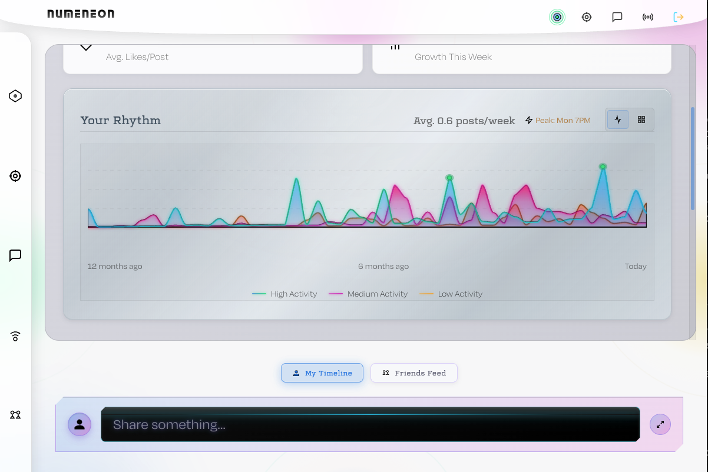 | 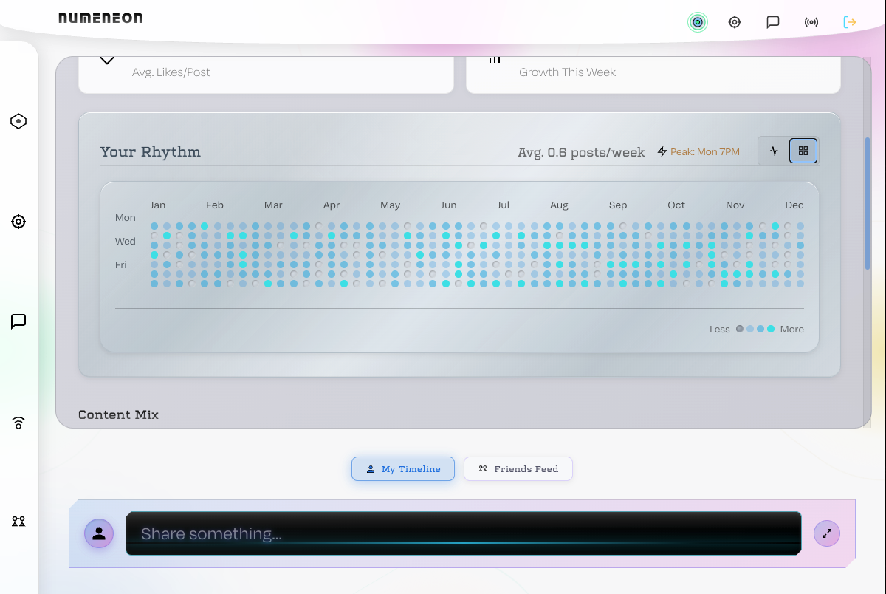 |

---

## 🛠️ Tech Stack

| Layer    | Tech                                          |
| -------- | --------------------------------------------- |
| Frontend | React 18, Vite, React Router, SCSS            |
| Backend  | Django 4.x, Django REST Framework, Simple JWT |
| Database | SQLite (dev), PostgreSQL (prod)               |

---

## 👥 Contributors

NUMENEON was built as a collaborative bootcamp project by:

| Name               | Role                         | Responsibilities                                                                                                                                       |
| ------------------ | ---------------------------- | ------------------------------------------------------------------------------------------------------------------------------------------------------ |
| **Colin Weir**     | Team Lead & Posts System     | Posts backend/frontend, data flow architecture, PostsContext, code review                                                                              |
| **Crystal Ruiz**   | Friends System               | Friends backend/frontend, FriendsContext, friend request UI, social features                                                                           |
| **Natalia Pricop** | Auth & Backend               | Authentication system, user registration/login, Django migrations, backend APIs                                                                        |
| **Tito**           | ⚙️ Infrastructure            | API client setup, theme system, app entry points, utilities                                                                                            |
| **Pablo Cordero**  | UI Architect & Visual Design | Timeline River UI, Profile Card flip system, Activity Visualization (Wave Chart + Heatmap), Messaging Modal, Mobile responsiveness, SCSS design system |

### Collective Contributions

This project represents a true team effort. Key achievements include:

- **River Timeline** — A unique 3-column feed design that reimagines social media scrolling
- **Real-time Messaging** — Full DM system with conversation management
- **Activity Analytics** — Wave chart and GitHub-style heatmap visualizations
- **Cyberpunk Design System** — Cohesive glassmorphic UI with neon aesthetics
- **Full-stack Integration** — Seamless Django REST + React architecture

---

_"In the neon glow, every post tells a story."_
